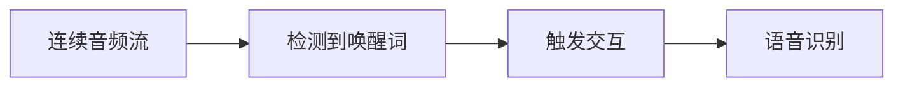
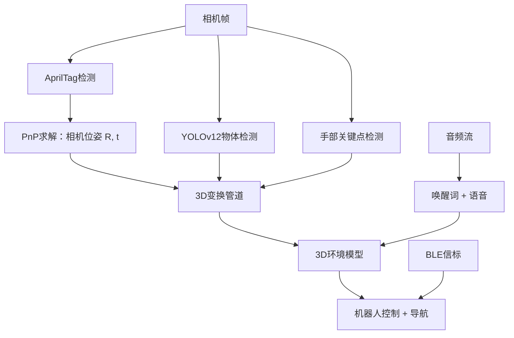
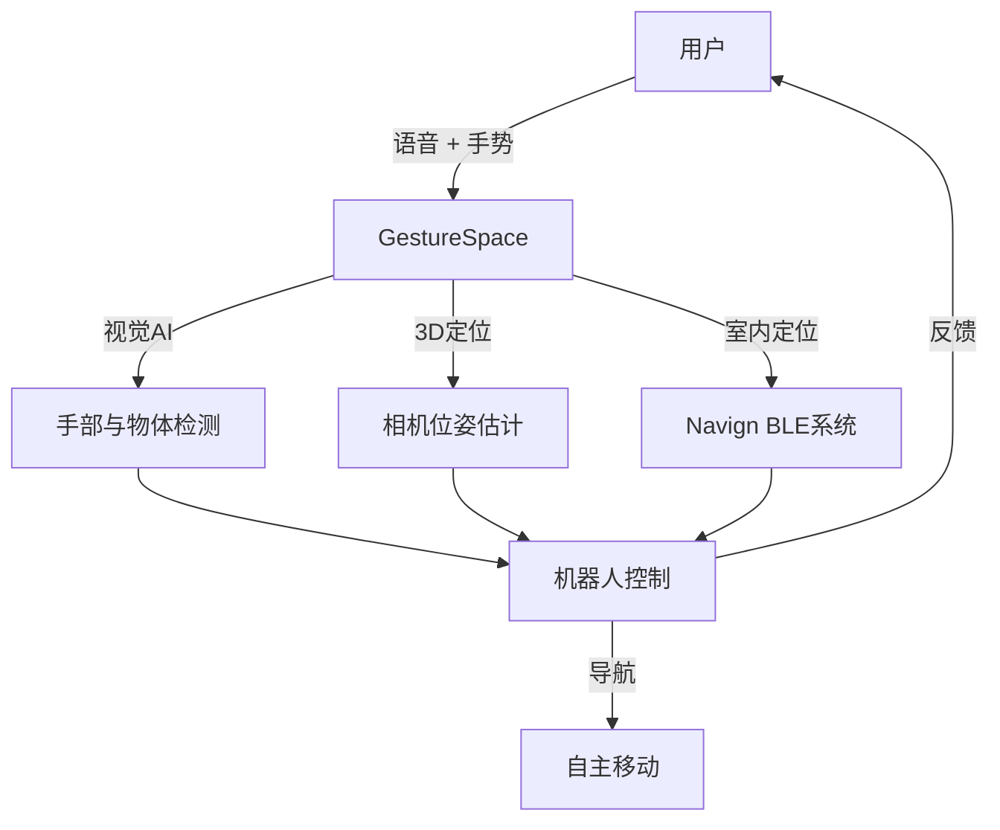

# GestureSpace

面向无障碍室内机器人的智能多模态交互系统

  
    按空格键进入下一页 <carbon:arrow-right class="inline"/>
  

---
layout: center
---

# 问题背景

---
layout: two-cols
---

# 无障碍危机

<v-clicks>

## 🇨🇳 中国的挑战

- **1731万** 视障人士
- 全国仅约 **400只** 导盲犬
- **1:40,000** 的比例（导盲犬与人）
- 训练成本高、训练周期长

</v-clicks>

::right::

<v-clicks>

## 🏢 室内导航挑战

**复杂的室内环境：**
- GPS信号弱
- 多楼层环境
- 动态障碍物

**现有解决方案的不足：**
- ❌ UWB：成本过高
- ❌ 配送机器人：5万美元以上，不稳定
- ❌ 机器狗：牵引力弱
- ❌ 无法在人群中导航

</v-clicks>

---
layout: center
class: text-center
---

# 我们的解决方案：GestureSpace

<v-clicks>

## 🎯 用于环境理解的相机管道

一个综合的空间交互系统，结合：

**AprilTag 位姿估计** • **YOLOv12 检测** • **3D 变换** • **语音控制** • **蓝牙定位**

### 核心能力
- 📍 相机位置：**~2cm** 精度
- 🎯 物体定位：**~5cm** 精度  
- 🗺️ 蓝牙室内定位：**<2m** 精度
- 🤖 实时3D环境建图

</v-clicks>

---
layout: section
---

# 第一部分：GestureSpace 核心技术

**用于环境理解的相机管道**

---

# 1. 基于AprilTag的相机位姿估计

<v-clicks>

### 核心概念：坐标空间之间的映射
**目标**：通过观察已知地标（AprilTags）找到相机（机器人）在真实世界中的位置

### 步骤1：相机标定 - 获取相机参数
使用棋盘格图案找到内参矩阵 $K$ 和畸变系数：
$$
K = \begin{bmatrix} f_x & 0 & c_x \\ 0 & f_y & c_y \\ 0 & 0 & 1 \end{bmatrix}
$$
- $f_x, f_y$：焦距（相机缩放程度）
- $c_x, c_y$：主点（图像中心偏移）
- 校正镜头畸变以实现精确测量

### 步骤2：PnP（透视n点问题）- 求解相机位姿
已知：8个AprilTags的**已知世界位置** $(X_i, Y_i, Z_i)$ 和它们的**检测图像位置** $(u_i, v_i)$

求解：能最好地解释投影的相机旋转 $R$ 和平移 $t$：
$$
s \begin{bmatrix} u_i \\ v_i \\ 1 \end{bmatrix} = K [R | t] \begin{bmatrix} X_i \\ Y_i \\ Z_i \\ 1 \end{bmatrix}
$$

世界坐标系中的相机位置：$\mathbf{C} = -R^T t$ → 机器人知道自己在哪里了！（~2cm精度）

</v-clicks>

---

# 2. 将图像中的物体映射到真实世界

<v-clicks>

### 核心概念：如何找到物体的真实世界位置
**已知**：物体在图像像素 $(u, v)$ 处，相机位姿 $[R | t]$ 来自PnP求解

**问题**：一个2D像素可能对应空间中3D射线上的任何点！

### 变换管道

**步骤1：图像 → 相机射线**（使用 $K$ 反向投影）
$$
\begin{bmatrix} x \\ y \\ 1 \end{bmatrix} = K^{-1} \begin{bmatrix} u \\ v \\ 1 \end{bmatrix} \quad \text{（归一化相机坐标）}
$$

**步骤2：相机射线 → 世界射线**（使用相机位姿 $R$）
$$
\mathbf{ray}_{world} = R \cdot \begin{bmatrix} x \\ y \\ 1 \end{bmatrix}, \quad \text{归一化为单位向量}
$$

**步骤3：射线-平面相交**（假设物体在地面 $Z = Z_0$）
$$
\mathbf{P}_{world} = \mathbf{C} + s \cdot \mathbf{ray}_{world}, \quad s = \frac{Z_0 - C_z}{ray_z}
$$

**结果**：物体的真实世界坐标 $(X, Y, Z_0)$，精度约5cm！

</v-clicks>

---

# 3. 基于YOLOv12的物体检测

<v-clicks>

### 技术
- **Ultralytics YOLOv12 Large**（yolo12l.pt）
- **基于Transformer的架构**（非CNN）
- 实时检测与分类

### 管道
1. 在相机帧中检测物体
2. 提取边界框（xyxy格式）和类别名称
3. 计算图像空间中的中心点 (u, v)
4. 使用相机位姿转换到3D世界坐标
5. 输出：物体名称、位置 (x, y, z)、置信度分数

### 集成
- 物体位置映射到3D空间
- 结合语音命令："把那个瓶子拿给我"
- 机器人可以导航到检测到的物体

</v-clicks>

---

# 4. 手部关键点检测与手指指向

<v-clicks>

### MediaPipe Hands
- 实时检测21个手部关键点
- 追踪手指位置以进行交互
- **注意**：用于指向检测，不是手势分类

### 手指方向管道
1. 提取食指MCP（基部）和指尖关键点
2. 将两个点都转换到3D世界坐标
3. 计算归一化方向向量
4. 输出：3D空间中的指向方向

### 应用
- 指向物体让机器人识别
- 指示导航方向
- 与环境进行空间交互

</v-clicks>

---

# 5. 语音唤醒词检测

<v-clicks>

### Porcupine 唤醒词引擎
- 始终监听模式，**CPU使用率低**
- 基于关键词索引的触发
- 即时激活

### 工作流程

**示例**："嘿 GestureSpace" → 机器人激活并开始监听

</v-clicks>

---

# 6. 语音识别与响应

<v-clicks>

### 音频管道
1. **唤醒词** 触发录音
2. **语音转文本** 识别
3. **自然语言理解** 用户请求
4. **上下文感知响应** 使用本地LLM
5. **文本转语音** 音频反馈

### 多模态集成
- 🗣️ "给我看看瓶子" + 👉 手指指向位置
- 🗣️ "把那个东西拿给我" → 通过YOLO识别 + 3D定位
- 语音 + 视觉 + 空间理解 = 自然交互

</v-clicks>

---
layout: center
class: text-center
---

# 相机管道集成

所有组件协同工作以理解环境

---
layout: section
---

# 第二部分：导航系统（Navign）

**GestureSpace的精确室内定位**

---
layout: two-cols
---

# BLE信标基础设施

<v-clicks>

### 硬件
- **ESP32-C3** 微控制器
- 四种信标类型：
  - 🏪 商户
  - 🛤️ 通道
  - 🔗 连接
  - 🚪 闸机

### 定位
- **基于RSSI的三角测量**
- 实时距离计算
- 商场内 **<2m精度**

</v-clicks>

::right::

<v-clicks>

# 安全性

### 密码学保护
- ✅ **P-256 ECDSA** 签名
- ✅ **TOTP** 身份验证
- ✅ **基于Nonce** 的挑战-响应
- ✅ 重放攻击防护
- ✅ 硬件密钥存储（ESP32 efuse）

### 访问控制
- 通过移动应用解锁门
- 闸机身份验证
- 商户空间授权

</v-clicks>

---

# 高级路径规划

<v-clicks>

### 后端（Rust）
- 使用bump分配的 **Dijkstra算法**
- 超快速路由：典型布局 **<1ms**
- 多楼层支持：
  - 电梯
  - 扶梯
  - 楼梯
- 动态区域连接图

### 移动体验（Vue 3 + Tauri 2.0）
- 跨平台：iOS、Android、macOS、Windows、Linux
- **MapLibre GL** + Konva 画布
- 实时导航覆盖层
- 生物识别认证（Face ID、Touch ID）

</v-clicks>

---
layout: section
---

# 第三部分：GestureSpace驱动的机器人

**完整的机器人助手**

---

# 机器人架构

<v-clicks>

## 双层设计

### 上层（Raspberry Pi / Jetson Nano）
- **ROS2核心** 用于协调
- **GestureSpace运行在这里** 🎯
- 6个子系统：视觉、音频、蓝牙、Navign、任务、串口

### 下层（STM32 + Embassy Rust）
- 实时电机控制
- **12自由度** 舵机管理（每条腿3个 × 4条腿）
- 硬件抽象层
- 紧急停止和安全系统

</v-clicks>

---

# GestureSpace如何控制机器人

<v-clicks>

### 相机管道控制
- 👁️ **物体识别**："把瓶子拿给我" → YOLOv12检测 + 3D定位
- 👉 **手指指向**：指向目的地 → 3D方向向量 → 机器人导航
- 🗣️ **语音 + 视觉**："去那里" + 指向 → 组合空间理解

### 自主导航
- 来自Navign信标的BLE定位
- AprilTag地标用于精确位姿校正
- 使用物体检测避障

### 多模态反馈
- 🔊 命令的音频确认
- 💡 机器人上的视觉LED指示器
- 📱 移动应用的实时状态更新

</v-clicks>

---

# 导航系统集成

<v-clicks>

### 基于BLE的定位
- 机器人配备 **BLE扫描器**
- 接收信标信号用于室内定位
- 与Navign服务器同步

### 路径规划与执行
1. 服务器向机器人发送最优路径
2. 机器人跟随路径点并进行局部避障
3. 路径阻塞时动态重新规划

### 多楼层能力
- 自主电梯使用（未来）
- 楼梯/扶梯检测和避让
- 楼层转换协调

</v-clicks>

---

# 配送与辅助功能

<v-clicks>

### 视障人士导盲模式 🦮
- 机器人充当 **机器人导盲犬**
- 语音引导导航
- 障碍物检测和警告
- 通过触觉手柄进行物理引导（未来）

### 配送模式 📦
- 货舱中的物品运输
- 自主导航到目的地
- 通过应用进行安全配送确认
- 返回充电站

### 交互模式
- **被动跟随**：机器人通过BLE追踪用户
- **主动引导**：机器人沿最优路径引导用户
- **取物与送回**：语音命令 → 找到物体 → 送回

</v-clicks>

---
layout: center
class: text-center
---

# 完整的GestureSpace解决方案

---
layout: two-cols
---

# 关键要点

<v-clicks>

### 🎯 三大支柱
1. **GestureSpace**：用于空间理解的相机管道
2. **Navign**：BLE室内定位和安全
3. **集成机器人**：自主辅助和配送

### 💡 影响
- 赋能 **1731万** 视障人士
- **~2cm** 相机位姿，**~5cm** 物体定位
- 经济高效的BLE解决方案
- 可扩展到商场、医院、办公室

</v-clicks>

::right::

<v-clicks>

### 🛠️ 技术栈

**编程语言：**
- Rust（后端/嵌入式）
- Python（AI/视觉）
- TypeScript（移动端）

**框架：**
- ROS2、MediaPipe、YOLOv12
- Vue 3、Tauri 2.0
- OpenCV、PyTorch

**硬件：**
- ESP32-C3 信标
- Orange Pi
- STM32 电机控制

</v-clicks>

---
layout: end
---

# 谢谢！

## 有问题吗？

**GestureSpace** - 让所有人都能享受无障碍的室内导航

  

    项目：indoor-mall-nav/navign | 许可证：MIT
  

