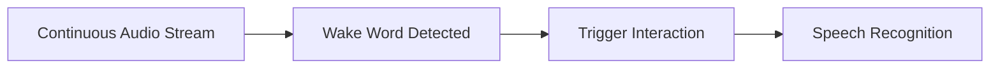
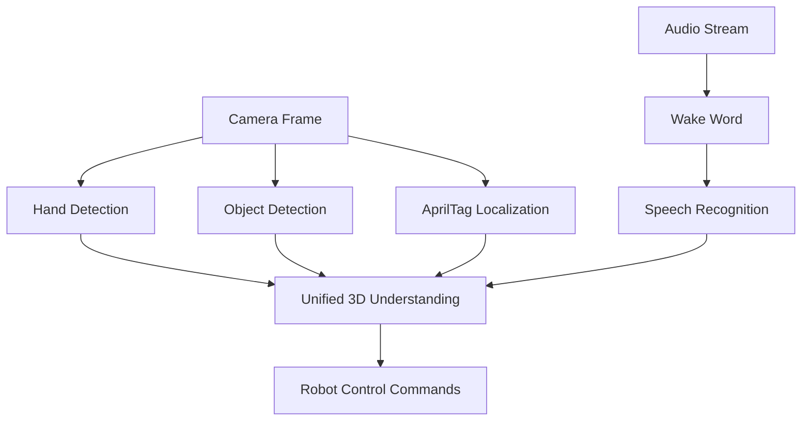
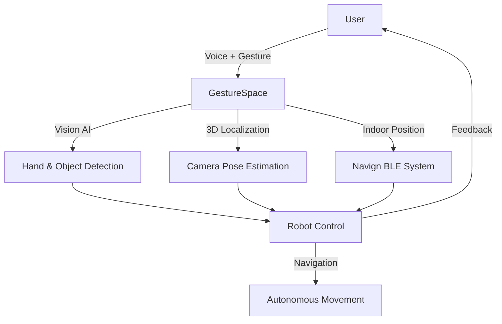

# GestureSpace

An Intelligent Multimodal Interaction System for Accessible Indoor Robotics

<div class="pt-12">
  <span @click="$slidev.nav.next" class="px-2 py-1 rounded cursor-pointer" hover="bg-white bg-opacity-10">
    Press Space for next page <carbon:arrow-right class="inline"/>
  </span>
</div>

---
layout: center
---

# The Problem

---
layout: two-cols
---

# The Accessibility Crisis

<v-clicks>

## 🇨🇳 China's Challenge

- **17.31 million** visually impaired people
- Only **~400 guide dogs** nationwide
- **1:40,000** ratio (dog to people)
- High training cost & long training period

</v-clicks>

::right::

<v-clicks>

## 🏢 Indoor Navigation Challenges

**Complex indoor environments:**
- Weak GPS signals
- Multiple floors
- Dynamic obstacles

**Current solutions fall short:**
- ❌ UWB: Too expensive
- ❌ Delivery robots: $50k+, unstable
- ❌ Dog robots: Weak pulling power
- ❌ Can't navigate crowds

</v-clicks>

---
layout: center
class: text-center
---

# Our Solution: GestureSpace

<v-clicks>

## 🎯 Vision + Voice + Gesture + Location

A comprehensive multimodal interaction system combining:

**Computer Vision** • **Gesture Recognition** • **Voice Control** • **BLE Indoor Positioning**

</v-clicks>

---
layout: section
---

# Part 1: GestureSpace Core Techniques

**6 Key Technologies in 2 Minutes**

---

# 1. Hand Gesture Recognition

<v-clicks>

## Technology Stack
- **MediaPipe Hands**: 21 hand landmarks per hand in real-time
- **Custom CNN Classifier**: 4-class gesture recognition
  - Conv2D → MaxPool2D → FC (40→64→4)
  - 70% dropout for robustness
  - Data augmentation: rotation, flip

## Applications
- 👉 Point-and-command interface
- 🧭 Direction indication for robot navigation
- ✋ Natural gesture-based control

</v-clicks>

---

# 2. Finger Pointing Direction Detection

<v-clicks>

## How It Works

```python
# 1. Extract index finger landmarks (base MCP + tip)
base = hand_landmarks.landmark[5]  # MCP joint
tip = hand_landmarks.landmark[8]   # Fingertip

# 2. Transform to 3D world coordinates
base_3d = get_point_3d_place(base, Z0, camera_pos, R)
tip_3d = get_point_3d_place(tip, Z0, camera_pos, R)

# 3. Calculate normalized direction vector
direction = (tip_3d - base_3d) / ||tip_3d - base_3d||
```

## Use Cases
- Point to objects for identification
- Indicate desired navigation direction
- Spatial interaction with environment

</v-clicks>

---

# 3. Object Detection with YOLOv8

<v-clicks>

## Technology
- **Ultralytics YOLOv8 Large** (yolo12l.pt)
- Real-time detection & classification
- Outputs:
  - Object class names
  - Confidence scores
  - Bounding boxes (xyxy format)
  - 3D center point localization

## Integration
Works seamlessly with finger pointing:
- "Bring me **that bottle**" + 👉 pointing gesture
- Robot identifies object and navigates to it

</v-clicks>

---

# 4. 3D Localization & Camera Pose

<v-clicks>

## AprilTag-Based Calibration
- **8 AprilTags** (tag36h11) at known world positions
- Camera intrinsics from chessboard calibration
- Real-time pose estimation using **solvePnP**

## 3D Point Reconstruction Pipeline

```python
1. Undistort image points → camera matrix K
2. Generate ray in camera coordinates
3. Transform ray to world coords → R_world
4. Intersect ray with ground plane (Z = Z0)
5. Calculate 3D world position
```

## Accuracy
- Camera position: **~2cm**
- Object localization: **~5cm** on ground plane

</v-clicks>

---

# 5. Voice Wake Word Detection

<v-clicks>

## Porcupine Wake Word Engine
- Always-listening mode with **low CPU usage**
- Keyword index-based trigger
- Instant activation

## Workflow


**Example**: "Hey GestureSpace" → Robot activates and listens

</v-clicks>

---

# 6. Speech Recognition & Response

<v-clicks>

## Audio Pipeline
1. **Wake word** triggers recording
2. **Speech-to-text** recognition
3. **Natural language understanding** for user requests
4. **Context-aware response** using local LLM
5. **Text-to-speech** audio feedback

## Multimodal Integration
- 🗣️ "Show me the bottle" + 👉 finger pointing
- 🗣️ "Navigate to exit" + 🧭 gesture direction
- Voice + Vision + Gesture = Natural interaction

</v-clicks>

---
layout: center
class: text-center
---

# System Integration

All 6 components work together in real-time



---
layout: section
---

# Part 2: Navigation System (Navign)

**Precise Indoor Positioning for GestureSpace**

---
layout: two-cols
---

# BLE Beacon Infrastructure

<v-clicks>

## Hardware
- **ESP32-C3** microcontrollers
- Four beacon types:
  - 🏪 Merchant
  - 🛤️ Pathway
  - 🔗 Connection
  - 🚪 Turnstile

## Positioning
- **RSSI-based triangulation**
- Real-time distance calculation
- **<2m accuracy** in malls

</v-clicks>

::right::

<v-clicks>

# Security

## Cryptographic Protection
- ✅ **P-256 ECDSA** signatures
- ✅ **TOTP** authentication
- ✅ **Nonce-based** challenge-response
- ✅ Replay attack prevention
- ✅ Hardware key storage (ESP32 efuse)

## Access Control
- Door unlocking via mobile app
- Turnstile authentication
- Merchant space authorization

</v-clicks>

---

# Advanced Pathfinding

<v-clicks>

## Backend (Rust)
- **Dijkstra algorithm** with bump allocation
- Ultra-fast routing: **<1ms** for typical layouts
- Multi-floor support:
  - Elevators
  - Escalators
  - Stairs
- Dynamic area connectivity graph

## Mobile Experience (Vue 3 + Tauri 2.0)
- Cross-platform: iOS, Android, macOS, Windows, Linux
- **MapLibre GL** + Konva canvas
- Real-time navigation overlay
- Biometric authentication (Face ID, Touch ID)

</v-clicks>

---
layout: section
---

# Part 3: GestureSpace-Powered Robot

**The Complete Robotic Assistant**

---

# Robot Architecture

<v-clicks>

## Dual-Layer Design

### Upper Layer (Raspberry Pi / Jetson Nano)
- **ROS2 core** for coordination
- **GestureSpace runs here** 🎯
- 6 subsystems: Vision, Audio, Bluetooth, Navign, Tasks, Serial

### Lower Layer (STM32 + Embassy Rust)
- Real-time motor control
- **12-DOF** servo management (3 per leg × 4 legs)
- Hardware abstraction layer
- Emergency stop & safety systems

</v-clicks>

---

# How GestureSpace Controls the Robot

<v-clicks>

## Vision-Based Control
- 👁️ **Object Recognition**: "Bring me the bottle" → YOLOv8 detection
- 👉 **Gesture Commands**: Point to destination → Robot navigates
- 🗣️ **Voice + Gesture**: "Go there" + pointing → Combined input

## Autonomous Navigation
- BLE positioning from Navign beacons
- AprilTag landmarks for precise pose correction
- Obstacle avoidance using object detection

## Multimodal Feedback
- 🔊 Audio confirmation of commands
- 💡 Visual LED indicators on robot
- 📱 Real-time status updates to mobile app

</v-clicks>

---

# Navigation System Integration

<v-clicks>

## BLE-Based Localization
- Robot equipped with **BLE scanner**
- Receives beacon signals for indoor positioning
- Synchronizes with Navign server

## Pathfinding & Execution
1. Server sends optimal path to robot
2. Robot follows waypoints with local obstacle avoidance
3. Dynamic re-routing on path blockage

## Multi-Floor Capability
- Autonomous elevator usage (future)
- Stair/escalator detection and avoidance
- Floor transition coordination

</v-clicks>

---

# Delivery & Assistance Features

<v-clicks>

## Guide Mode for Visually Impaired 🦮
- Robot acts as **robotic guide dog**
- Voice-guided navigation
- Obstacle detection and warning
- Physical guidance via haptic handle (future)

## Delivery Mode 📦
- Item transport in cargo bay
- Autonomous navigation to destination
- Secure delivery confirmation via app
- Return to charging station

## Interaction Modes
- **Passive Following**: Robot follows user with BLE tracking
- **Active Guidance**: Robot leads user along optimal path
- **Fetch & Retrieve**: Voice command → Find object → Bring back

</v-clicks>

---
layout: center
class: text-center
---

# The Complete GestureSpace Solution



---
layout: two-cols
---

# Key Takeaways

<v-clicks>

## 🎯 Three Pillars
1. **GestureSpace**: Natural multimodal interaction
2. **Navign**: Precise indoor positioning & security
3. **Integrated Robot**: Autonomous assistance & delivery

## 💡 Impact
- Empowering **17.31M** visually impaired people
- Cost-effective BLE solution
- Scalable to malls, hospitals, offices
- Military-grade cryptography

</v-clicks>

::right::

<v-clicks>

## 🛠️ Technology Stack

**Languages:**
- Rust (backend/embedded)
- Python (AI/vision)
- TypeScript (mobile)

**Frameworks:**
- ROS2, MediaPipe, YOLOv8
- Vue 3, Tauri 2.0
- OpenCV, PyTorch

**Hardware:**
- ESP32-C3 beacons
- Raspberry Pi / Jetson
- STM32 motor control

</v-clicks>

---
layout: center
class: text-center
---

# Demo Time! 🎬

<v-clicks>

1. 👋 Hand gesture controlling robot
2. 👁️ Object detection + finger pointing in real-time
3. 📱 Mobile app navigation
4. 🤖 Robot delivery animation

</v-clicks>

<div class="pt-12">
  <a href="https://github.com/indoor-mall-nav/navign" target="_blank" class="px-4 py-2 rounded bg-blue-600 hover:bg-blue-700">
    View on GitHub
  </a>
</div>

---
layout: end
---

# Thank You!

## Questions?

**GestureSpace** - Making indoor navigation accessible for all

<div class="absolute bottom-10">
  <p class="text-sm opacity-50">
    Project: indoor-mall-nav/navign | License: MIT
  </p>
</div>
