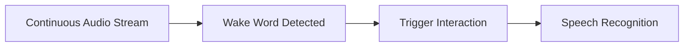
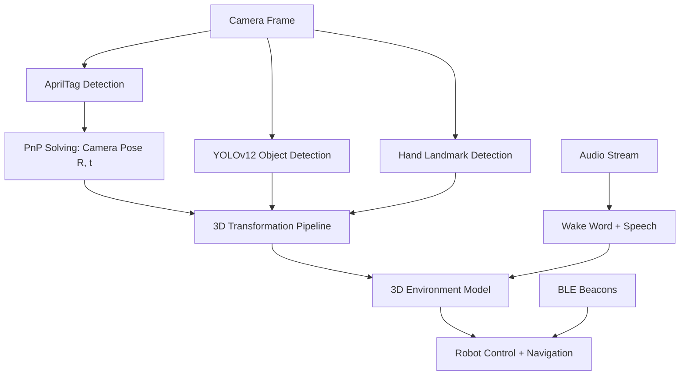
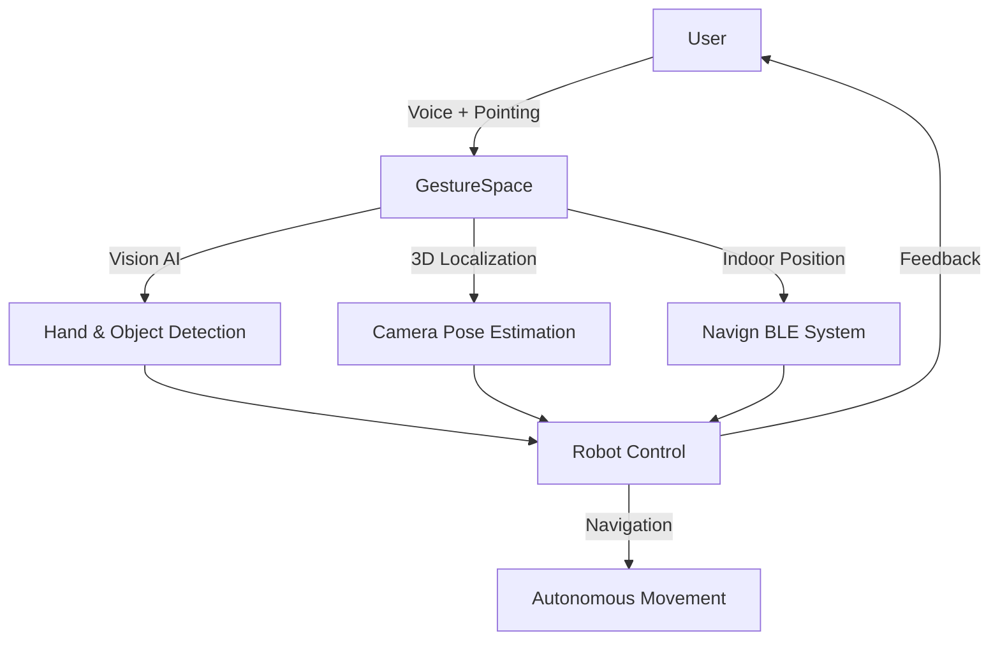

# GestureSpace

An Intelligent Multimodal Interaction System for Accessible Indoor Robotics

  
    Press Space for next page <carbon:arrow-right class="inline"/>
  

---
layout: center
---

# The Problem

---
layout: two-cols
---

# The Accessibility Crisis

<v-clicks>

## China's Challenge

- **17.31 million** visually impaired people
- Only **~400 guide dogs** nationwide
- **1:40,000** ratio (dog to people)
- High training cost & long training period

</v-clicks>

::right::

<v-clicks>

## Indoor Navigation Challenges

**Complex indoor environments:**
- Weak GPS signals
- Multiple floors
- Dynamic obstacles

**Current solutions fall short:**
- UWB: Too expensive
- Delivery robots: $50k+, unstable
- Dog robots: Weak pulling power
- Can't navigate crowds

</v-clicks>

---
layout: center
class: text-center
---

# Our Solution: GestureSpace

<v-clicks>

## Camera Pipeline for Environment Understanding

A comprehensive spatial interaction system combining:

**AprilTag Pose Estimation** • **YOLOv12 Detection** • **3D Transformation** • **Voice Control** • **BLE Positioning**

### Key Capabilities
- Camera position: **~2cm** accuracy
- Object localization: **~5cm** accuracy  
- BLE indoor positioning: **<2m** accuracy
- Real-time 3D environment mapping

</v-clicks>

---
layout: section
---

# Part 1: GestureSpace Core Techniques

**Camera Pipeline for Environment Understanding**

---

# 1. Camera Pose Estimation with AprilTags

<v-clicks>

### Core Concept: Mapping Between Coordinate Spaces
**Goal**: Find where the camera (robot) is in the real world by observing known landmarks (AprilTags)

### Step 1: Camera Calibration - Getting Camera Parameters
Use chessboard patterns to find intrinsic matrix $K$ and distortion coefficients:
$$
K = \begin{bmatrix} f_x & 0 & c_x \\ 0 & f_y & c_y \\ 0 & 0 & 1 \end{bmatrix}
$$
- $f_x, f_y$: focal lengths (how much camera zooms)
- $c_x, c_y$: principal point (image center offset)
- Corrects lens distortion for accurate measurements

</v-clicks>

---

<v-clicks>

### Step 2: PnP (Perspective-n-Point) - Finding Camera Pose
Given: 8 AprilTags at **known world positions** $(X_i, Y_i, Z_i)$ and their **detected image positions** $(u_i, v_i)$

Find: Camera rotation $R$ and translation $t$ that best explains the projection:
$$
s \begin{bmatrix} u_i \\ v_i \\ 1 \end{bmatrix} = K [R | t] \begin{bmatrix} X_i \\ Y_i \\ Z_i \\ 1 \end{bmatrix}
$$

Camera position in world: $\mathbf{C} = -R^T t$ → Robot knows where it is! (~2cm accuracy)

</v-clicks>

---

# 2. Mapping Objects from Image to Real World

<v-clicks>

### Core Concept: How to Find Object's Real World Position
**Given**: Object at image pixel $(u, v)$ and camera pose $[R | t]$ from PnP

**Problem**: A 2D pixel could correspond to any point along a 3D ray in space!

### The Transformation Pipeline

**Step 1: Image → Camera Ray** (Reverse projection using $K$)
$$
\begin{bmatrix} x \\ y \\ 1 \end{bmatrix} = K^{-1} \begin{bmatrix} u \\ v \\ 1 \end{bmatrix} \quad \text{(normalized camera coords)}
$$

</v-clicks>

---

<v-clicks>

**Step 2: Camera Ray → World Ray** (Using camera pose $R$)
$$
\mathbf{ray}_{world} = R \cdot \begin{bmatrix} x \\ y \\ 1 \end{bmatrix}, \quad \text{normalize to unit vector}
$$

**Step 3: Ray-Plane Intersection** (Assume object on ground $Z = Z_0$)
$$
\mathbf{P}_{world} = \mathbf{C} + s \cdot \mathbf{ray}_{world}, \quad s = \frac{Z_0 - C_z}{ray_z}
$$

**Result**: Object's real world coordinates $(X, Y, Z_0)$ with ~5cm accuracy!

</v-clicks>

---

# 3. Object Detection with YOLOv12

<v-clicks>

### Technology
- **Ultralytics YOLOv12 Large** (yolo12l.pt)
- **Transformer-based architecture** (not CNN)
- Real-time detection & classification

### Pipeline
1. Detect objects in camera frame
2. Extract bounding boxes (xyxy format) and class names
3. Calculate center points (u, v) in image space
4. Transform to 3D world coordinates using camera pose
5. Output: Object name, position (x, y, z), confidence score

### Integration
- Object positions mapped to 3D space
- Combined with voice commands: "Bring me that bottle"
- Robot can navigate to detected objects

</v-clicks>

---

# 4. Hand Landmark Detection & Finger Pointing

<v-clicks>

### MediaPipe Hands
- Detects 21 hand landmarks in real-time
- Tracks finger positions for interaction
- **Note**: Used for pointing detection, not gesture classification

### Finger Direction Pipeline
1. Extract index finger MCP (base) and tip landmarks
2. Transform both points to 3D world coordinates
3. Calculate normalized direction vector
4. Output: Pointing direction in 3D space

### Applications
- Point to objects for robot to identify
- Indicate navigation directions
- Spatial interaction with environment

</v-clicks>

---

# 5. Voice Wake Word Detection

<v-clicks>

### Porcupine Wake Word Engine
- Always-listening mode with **low CPU usage**
- Keyword index-based trigger
- Instant activation

### Workflow

**Example**: "Hey GestureSpace" → Robot activates and listens

</v-clicks>

---

# 6. Speech Recognition & Response

<v-clicks>

### Audio Pipeline
1. **Wake word** triggers recording
2. **Speech-to-text** recognition
3. **Natural language understanding** for user requests
4. **Context-aware response** using local LLM
5. **Text-to-speech** audio feedback

### Multimodal Integration
- "Show me the bottle" + finger pointing to location
- "Bring me that object" → identifies via YOLO + locates in 3D
- Voice + Vision + Spatial Understanding = Natural interaction

</v-clicks>

---
layout: center
class: text-center
---

# Camera Pipeline Integration

All components work together for environment understanding

---
layout: section
---

# Part 2: Navigation System (Navign)

**Precise Indoor Positioning for GestureSpace**

---
layout: two-cols
---

# BLE Beacon Infrastructure

<v-clicks>

### Hardware
- **ESP32-C3** microcontrollers
- Four beacon types:
  - Merchant
  - Pathway
  - Connection
  - Turnstile

### Positioning
- **RSSI-based triangulation**
- Real-time distance calculation
- **<2m accuracy** in malls

</v-clicks>

::right::

<v-clicks>

# Security

### Cryptographic Protection
- **P-256 ECDSA** signatures
- **TOTP** authentication
- **Nonce-based** challenge-response
- Replay attack prevention
- Hardware key storage (ESP32 efuse)

### Access Control
- Door unlocking via mobile app
- Turnstile authentication
- Merchant space authorization

</v-clicks>

---

# Advanced Pathfinding

<v-clicks>

### Backend (Rust)
- **Dijkstra algorithm** with bump allocation
- Ultra-fast routing: **<1ms** for typical layouts
- Multi-floor support:
  - Elevators
  - Escalators
  - Stairs
- Dynamic area connectivity graph

### Mobile Experience (Vue 3 + Tauri 2.0)
- Cross-platform: iOS, Android, macOS, Windows, Linux
- **MapLibre GL** + Konva canvas
- Real-time navigation overlay
- Biometric authentication (Face ID, Touch ID)

</v-clicks>

---
layout: section
---

# Part 3: GestureSpace-Powered Robot

**The Complete Robotic Assistant**

---

# Robot Architecture

<v-clicks>

## Dual-Layer Design

### Upper Layer (Raspberry Pi / Jetson Nano)
- **ROS2 core** for coordination
- **GestureSpace runs here**
- 6 subsystems: Vision, Audio, Bluetooth, Navign, Tasks, Serial

### Lower Layer (STM32 + Embassy Rust)
- Real-time motor control
- **Wheel-based robot** drive control
- Hardware abstraction layer
- Emergency stop & safety systems

</v-clicks>

---

# How GestureSpace Controls the Robot

<v-clicks>

### Camera Pipeline Control
- **Object Recognition**: "Bring me the bottle" → YOLOv12 detection + 3D localization
- **Finger Pointing**: Point to destination → 3D direction vector → Robot navigates
- **Voice + Vision**: "Go there" + pointing → Combined spatial understanding

### Autonomous Navigation
- BLE positioning from Navign beacons
- AprilTag landmarks for precise pose correction
- Obstacle avoidance using object detection

### Multimodal Feedback
- Audio confirmation of commands
- Visual LED indicators on robot
- Real-time status updates to mobile app

</v-clicks>

---

# Navigation System Integration

<v-clicks>

### BLE-Based Localization
- Robot equipped with **BLE scanner**
- Receives beacon signals for indoor positioning
- Synchronizes with Navign server

### Pathfinding & Execution
1. Server sends optimal path to robot
2. Robot follows waypoints with local obstacle avoidance
3. Dynamic re-routing on path blockage

### Multi-Floor Capability
- Autonomous elevator usage (future)
- Stair/escalator detection and avoidance
- Floor transition coordination

</v-clicks>

---

# Delivery & Assistance Features

<v-clicks>

### Guide Mode for Visually Impaired
- Robot acts as **robotic guide dog**
- Voice-guided navigation
- Obstacle detection and warning
- Physical guidance via haptic handle (future)

### Delivery Mode
- Item transport in cargo bay
- Autonomous navigation to destination
- Secure delivery confirmation via app
- Return to charging station

### Interaction Modes
- **Passive Following**: Robot follows user with BLE tracking
- **Active Guidance**: Robot leads user along optimal path
- **Fetch & Retrieve**: Voice command → Find object → Bring back

</v-clicks>

---
layout: center
class: text-center
---

# The Complete GestureSpace Solution

---
layout: two-cols
---

# Key Takeaways

<v-clicks>

### Three Pillars
1. **GestureSpace**: Camera pipeline for spatial understanding
2. **Navign**: BLE indoor positioning & security
3. **Integrated Robot**: Autonomous assistance & delivery

### Impact
- Empowering **17.31M** visually impaired people
- **~2cm** camera pose, **~5cm** object localization
- Cost-effective BLE solution
- Scalable to malls, hospitals, offices

</v-clicks>

::right::

<v-clicks>

### Technology Stack

**Languages:**
- Rust (backend/embedded)
- Python (AI/vision)
- TypeScript (mobile)

**Frameworks:**
- ROS2, MediaPipe, YOLOv12
- Vue 3, Tauri 2.0
- OpenCV, PyTorch

**Hardware:**
- ESP32-C3 beacons
- Orange Pi
- STM32 motor control

</v-clicks>

---
layout: end
---

# Thank You!

## Questions?

**GestureSpace** - Making indoor navigation accessible for all

  

    Project: indoor-mall-nav/navign | License: MIT
  

